# Wattio

## Introdução 

O Wattio é conhecido por ser um sistema completo de gestão de Geração Distribuída. O diferencial do sistema se dá no fato de que ele atua desde a captação do lead até a gestão financeira e operacional da empresa, facilitando no processo de compartilhamento de créditos de energia. O sistema é capaz de automatizar a leitura de faturas, gerir os clientes e seus contratos, assim como, também disponibiliza dashboards e aplicativos integrados que auxiliam num uso mais aperfeiçoado da ferramenta.

---

## Gestão de Comercial e Usuários
>A maioria dos caminhos para Gestão de Comercial estão na aba do Wattio: Menu Principal > Geração Distribúida > Vendas

### Cadastro de Pessoa Física

O cadastro de "Contacts" (Contatos) na linguagem utilizada pelo Wattio pode parecer ambíguo inicialmente, mas é um conceito fácil de esclarecer. A categoria "Contacts" engloba qualquer pessoa que seja um usuário, cliente ou empresa. Portanto, na mesma aba de cadastro, é possível registrar múltiplas modalidades de contatos.

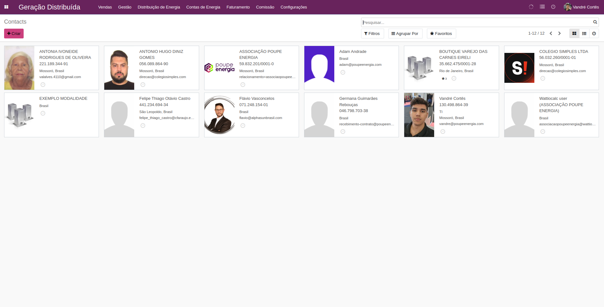

A criação de uma **Pessoa Física** no Wattio é simples e objetiva. No caminho `Vendas > Cadastros`, basta clicar na opção `+ Criar` e, em seguida, selecionar o tipo de cadastro **Individual** para iniciar o preenchimento dos dados. É importante ressaltar que, embora o sistema não exija a obrigatoriedade de preenchimento do **nome**, **CPF** e **e-mail** para finalização do cadastro, a ausência desses dados impedirá a realização de determinados procedimentos no futuro, portanto, é de suma importância cadastrá-los.

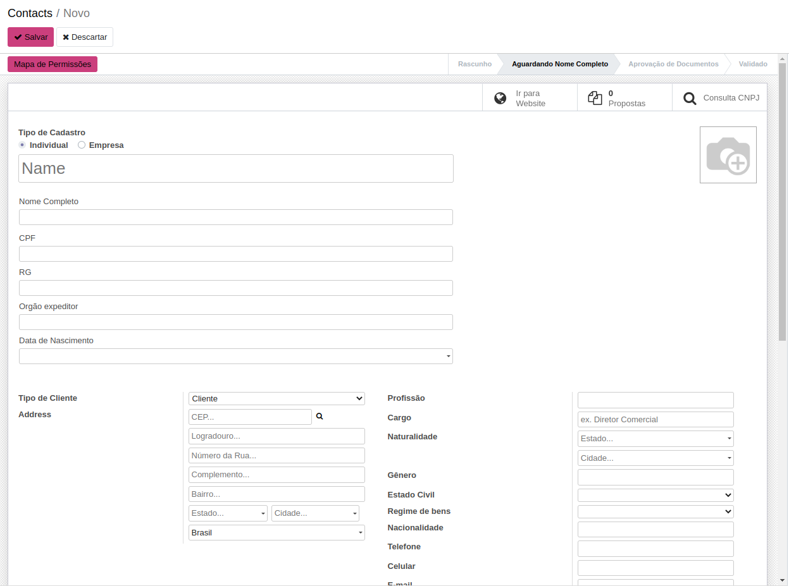

Ainda na tela de criação de Pessoa Física, duas funcionalidades se destacam. Mais abaixo, há diversas opções para agregar informações ao cadastro, sendo as seções **"Documentos"** e **"Empresas Vinculadas"** as mais utilizadas.

**Documentos**

Esta seção é utilizada para anexar a documentação dos "Contacts", tanto de Pessoas Físicas quanto Jurídicas.

- **Para Pessoa Física (PF):** São necessários o comprovante de endereço e um documento de identidade com foto.
- **Para Pessoa Jurídica (PJ):** São essenciais o comprovante de endereço, o cartão CNPJ e o contrato social.

Para enviar os arquivos, clique em Enviar Documento, depois em Faça upload do seu arquivo e selecione os itens em seu gerenciador de arquivos.

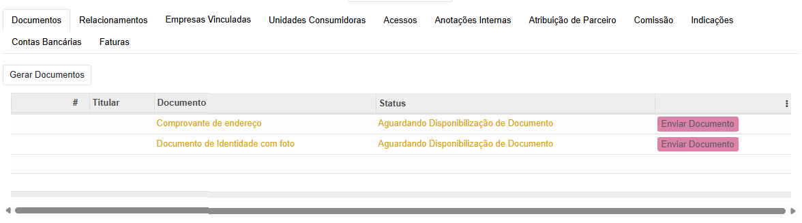

**Empresas Vinculadas**

Esta funcionalidade serve para vincular um contato a uma Pessoa Jurídica ou a outro contato já existente no sistema. A configuração é simples:

1. Clique em Adicionar linha na tabela exibida.
2. Selecione o tipo de relacionamento (vínculo).
3. No campo ao lado, selecione a Pessoa Física ou Jurídica com a qual deseja estabelecer a conexão.

O uso mais comum para este recurso é vincular uma Pessoa Física como Responsável Legal de uma Pessoa Jurídica.

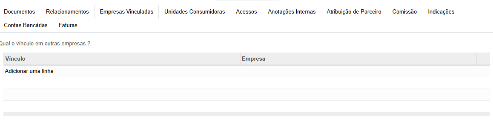

### Cadastro de Pessoa Jurídica

O cadastro de uma **Pessoa Jurídica (PJ)** no Wattio segue um processo muito semelhante ao de uma Pessoa Física, com algumas distinções importantes. O caminho inicial é o mesmo: `Vendas > Cadastros`, seguido pela opção `+ Criar`.

Neste ponto, as principais diferenças são a seleção do tipo de cadastro e os documentos necessários para envio. Em vez de "Individual", você deve escolher a opção **"Empresa"**. Consequentemente, o campo obrigatório para identificação não será o CPF, mas sim o **CNPJ**.

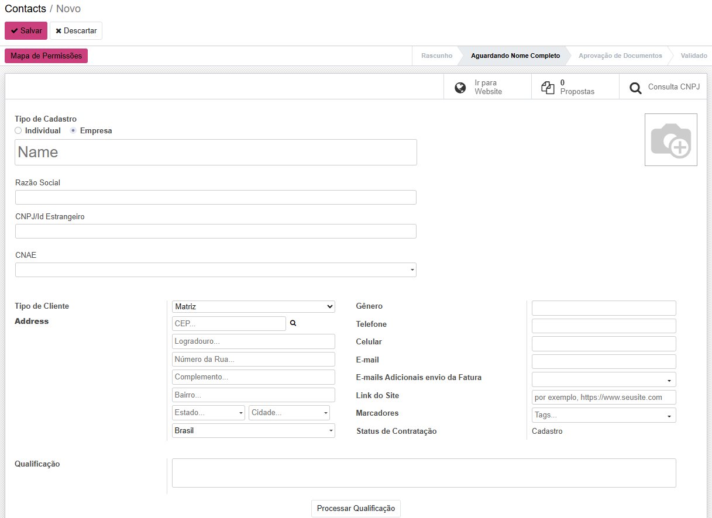

Um detalhe fundamental no cadastro de qualquer Pessoa Jurídica é a definição do seu representante legal. Toda operação vinculada a um CNPJ precisa ter um responsável por trás. Por isso, é **obrigatório** vincular uma Pessoa Física (previamente cadastrada) como **Responsável Legal**.

Para fazer isso, utilize a seção **"Empresas Vinculadas"**, seguindo os mesmos passos já mencionados:

1. Clique em `Adicionar linha`.
2. Selecione o tipo de relacionamento, como "Responsável Legal".
3. No campo de busca, localize e selecione o contato (Pessoa Física) que representará a empresa.

Após preencher os dados principais e vincular o responsável, basta salvar para concluir o cadastro da Pessoa Jurídica.

### Cadastro de Usuário

A criação de usuários que terão acesso ao sistema Wattio é um processo flexível, que pode ser realizado de duas maneiras distintas.

A primeira forma é diretamente durante o cadastro de um "Contact". Ao criar uma **Pessoa Física** ou **Pessoa Jurídica**, você encontrará um botão específico para **"Criar Usuário"**, permitindo associar um acesso ao sistema àquele contato recém-criado.

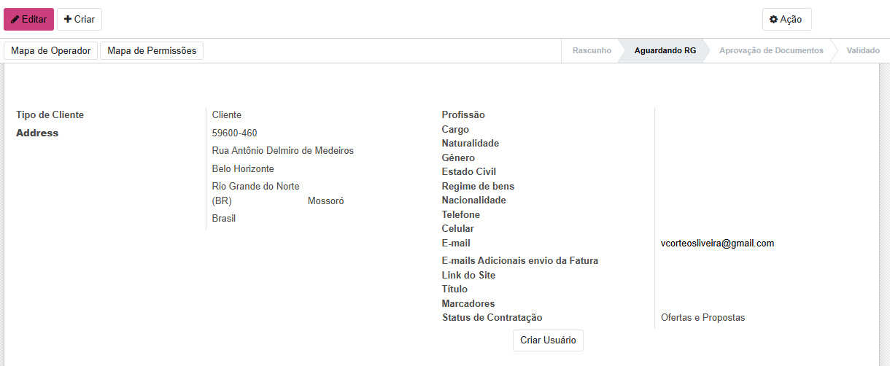

A segunda e mais centralizada forma de gerenciar os acessos é através do menu de configurações. Para isso, siga o caminho `Configurações > Gerenciar Usuários`. Nesta tela, basta clicar em `+ Criar` para iniciar o processo.

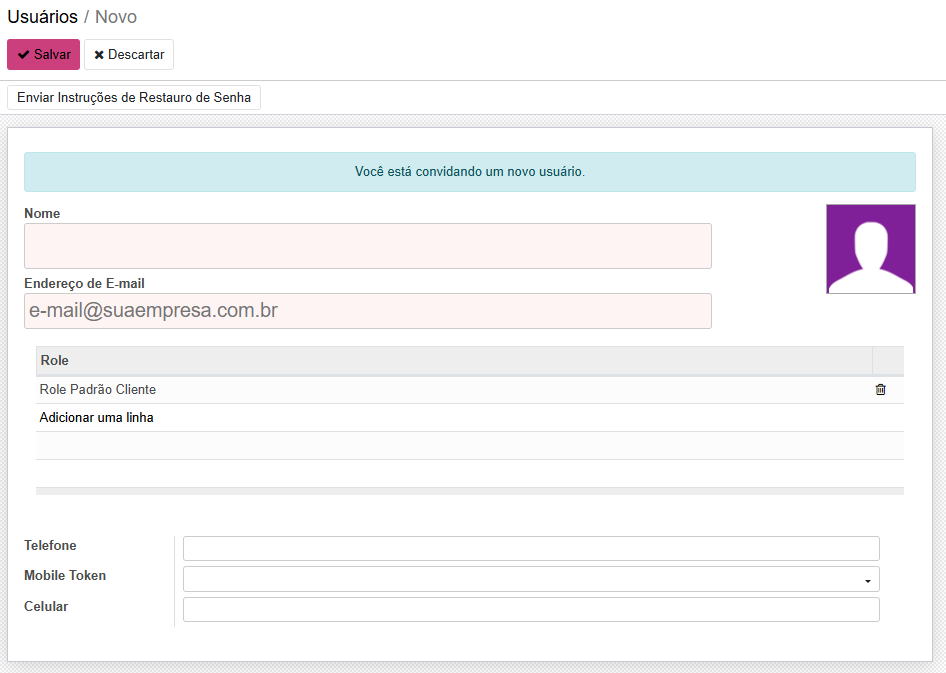

Você precisará preencher apenas o **Nome** e o **E-mail** do novo usuário. Logo abaixo, na tabela intitulada **"Role" (Perfil de Acesso)**, você deverá escolher qual será o nível de permissão que este usuário terá dentro do sistema.

Após o preenchimento desses campos, clique em **Salvar**. O sistema enviará automaticamente um e-mail para o endereço informado, contendo um link para a definição da senha. Assim que o usuário definir sua senha, ele já poderá acessar o sistema com as permissões estabelecidas pela "Role" que lhe foi atribuída.

---

## Gestão de Usinas
>Todos os caminhos para Gestão de Usinas estão na aba do Wattio: Menu Principal > Geração Distribúida > Gestão

### Cadastro de Modalidade Jurídica

Para realizar a gestão de usinas no Wattio, é fundamental entender seu pleno funcionamento e sua importância no sistema. Uma usina é, simultaneamente, uma **Unidade Geradora** e uma **Unidade Consumidora** (ambos os conceitos serão detalhados posteriormente). A função da usina é gerar energia renovável e fornecê-la à distribuidora, acumulando créditos energéticos para um CPF ou CNPJ. No entanto, como o sistema Wattio é projetado para gerir cooperativas e associações, nosso foco será estritamente em Pessoas Jurídicas, ou, como descrito no sistema, na Modalidade Jurídica.

O primeiro passo é cadastrar uma Modalidade Jurídica para vincular nossas usinas. Para isso, acesse o caminho `Gestão > Modalidade Jurídica` e clique na opção `+ Criar`.

O processo de criação é bastante direto. É necessário apenas preencher o nome da Razão Social — o campo em vermelho indica que o preenchimento é obrigatório. Opcionalmente, você também pode definir a capacidade disponível de geração (kWh/mês).

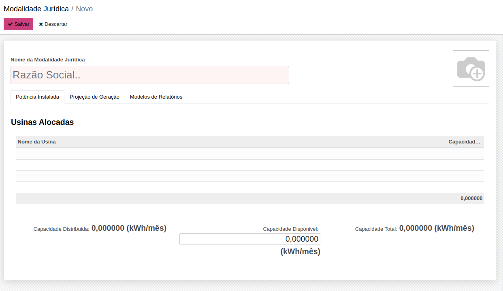

Na mesma tela, você encontrará as abas "Projeção de Geração" e "Modelos de Relatórios". Para mantermos uma linha de raciocínio lógica no aprendizado do sistema, abordaremos esses tópicos em um momento oportuno. Por enquanto, podemos simplesmente salvar para finalizar o cadastro da Modalidade Jurídica.

### Cadastro de Unidade Geradora

A **Unidade Geradora (UG)** representa a usina em sua função principal: produzir energia. O cadastro correto desta unidade é um passo essencial para que o sistema possa contabilizar e gerenciar a energia injetada na rede.

O processo de criação é bastante direto. Para cadastrar uma nova Unidade Geradora, siga o caminho: `Gestão > Unidade Geradora`.

Nesta tela, clique no botão `+ Criar` para abrir o formulário de cadastro. Você verá diversos campos para preencher com as informações técnicas da usina. No entanto, para fins de registro inicial no sistema, há apenas uma obrigatoriedade: o **Código da Instalação**. Com este código preenchido, você já pode clicar em **Salvar**.

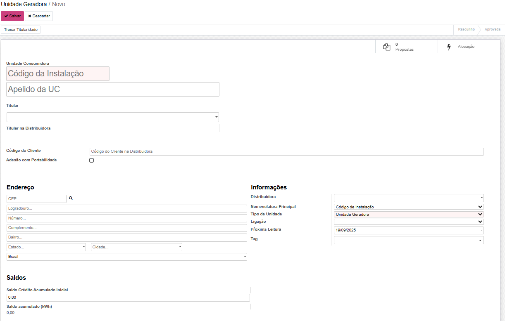

**Leitura de Documentos e Métricas**

Após o cadastro, a Unidade Geradora habilita funcionalidades importantes de extração de dados. O sistema permite, por exemplo, realizar a **leitura de um demonstrativo de pagamento** para análise financeira.

Além disso, uma vez que a Unidade Geradora esteja **vinculada a pelo menos uma Usina**, uma funcionalidade crucial é desbloqueada: a **leitura de faturas em PDF**. Ao fazer o upload do arquivo da fatura de energia, o sistema consegue extrair automaticamente os dados para gerar **métricas de consumo e um histórico detalhado de tarifas**, fornecendo uma visão completa do desempenho e dos custos associados à unidade.

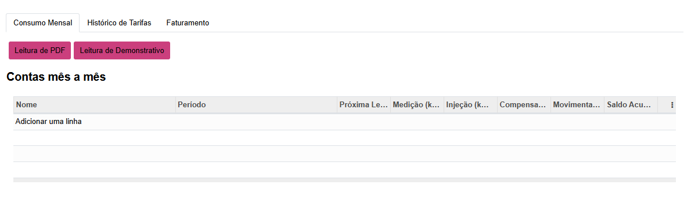

### Cadastro de Usinas

A **Usina** é uma das entidades centrais do sistema Wattio, pois conecta os aspectos legais (`Modalidade Jurídica`), físicos (`Unidade Geradora`) e financeiros (tarifas e faturamento) da geração de energia. Seu cadastro correto é vital para a automação dos processos de alocação e faturamento.

Para iniciar o cadastro de uma nova Usina, acesse o caminho `Gestão > Usinas` e, na tela seguinte, clique no botão `+ Criar`.

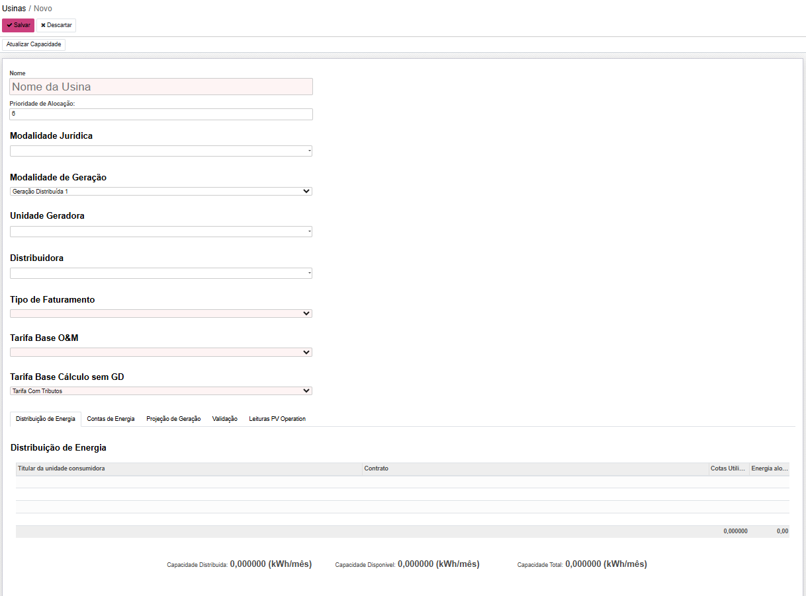

Você será direcionado para um formulário com os seguintes campos a serem preenchidos:

**Preenchimento dos Campos**

- **Nome da Usina:** (Obrigatório) Insira o nome de identificação da usina, que será usado para referenciá-la em todo o sistema.
- **Prioridade de Alocação:** Este campo numérico define a ordem em que as cotas de energia da usina serão distribuídas aos cooperados/associados. O processo é automático: o sistema preencherá primeiro as usinas de `Prioridade 1` com os contratos fechados até sua capacidade ser atingida, para só então passar para as de `Prioridade 2`, e assim por diante.
- **Modalidade Jurídica:** Vincule a usina à Pessoa Jurídica (previamente cadastrada) que a representa legalmente e financeiramente.
- **Modalidade de Geração:** Selecione o tipo de Geração Distribuída (GD) correspondente à usina, como `GD1`, `GD2`, conforme a regulamentação aplicável.
- **Unidade Geradora:** Associe a usina à sua respectiva Unidade Geradora, que representa a estrutura física e a instalação de geração de energia (previamente cadastrada).
- **Distribuidora:** Selecione na lista a companhia distribuidora de energia elétrica à qual a usina está conectada.
- **Tipo de Faturamento:** (Obrigatório) Defina qual métrica será a base para o faturamento. As opções são:
    - **Energia Injetada:** O cálculo é baseado na energia que a usina injeta na rede.
    - **Energia Compensada:** O cálculo é baseado na energia que é efetivamente compensada.
- **Tarifa Base O&M:** (Obrigatório) Refere-se à base de cálculo para a tarifa de **Operação e Manutenção (O&M)**. As opções são:
     - Tarifa sem Tributos
    - Tarifa com Tributos
    - Tarifa de Compensação
- **Tarifa Base Cálculo sem GD:** (Obrigatório) Define a tarifa de referência para cálculos que não envolvem a Geração Distribuída. As opções são as mesmas:
    - Tarifa sem Tributos
    - Tarifa com Tributos
    - Tarifa de Compensação

Após preencher ao menos os campos obrigatórios, clique em **Salvar** para registrar a Usina no sistema.

### Gerenciando a Usina: Seções Adicionais

Uma vez que a Usina está cadastrada, novas abas e seções se tornam disponíveis para um gerenciamento mais detalhado. As principais são:

**Contas de Energia** 

Nesta seção, é possível adicionar e manter um registro histórico das contas de energia da usina. Funciona como um repositório central para todos os faturamentos recebidos da distribuidora, facilitando a consulta e a análise de dados passados.

**Projeção de Geração**

Esta área é fundamental para parametrizar o potencial produtivo da usina. Aqui você pode configurar:

- **Capacidade Física da Usina:** O valor nominal ou técnico da capacidade de geração.
- **Capacidade Pico:** O valor máximo de geração que a usina pode atingir.
- **Capacidade Total a Considerar:** Define qual valor o sistema utilizará para os cálculos de alocação de cotas. As opções são:
    - `Utilizar o valor de média`
    - `Utilizar o valor de pico`
    - `Utilizar o valor de mínimo`
    - `Utilizar o valor fixo`

**Distribuição de Energia**

Esta seção funciona como um painel informativo. Ela exibe uma visão clara e detalhada de todas as **cotas de energia que já foram alocadas** para aquela usina, mostrando quais contratos e beneficiários estão vinculados a ela em um determinado período.

